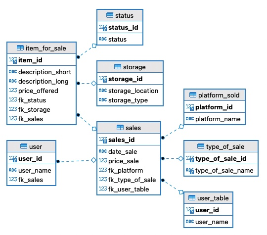
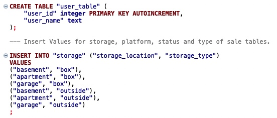
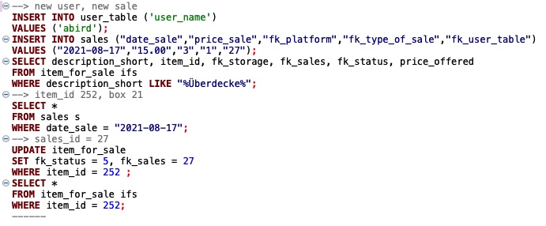
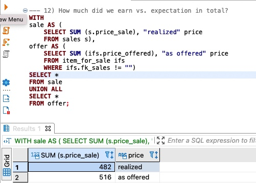

# Managing your 'Garage Sale' with SQLite

This repository documents creating a SQLite database and several queries. It was elaborated by  Sarah Dutschke. The information presented here is not approved for any kind of commercial use.

Project Team
-----------

[Sarah Dutschke](https://www.linkedin.com/in/sarah-dutschke/)

Project description
-------------------
Keeping an overview of your garage sale can be challenging:
 - 'In which box did I place the red handbag?'
 - 'How much did I earn up until now and by month? And for how much did I offer it?'
 - 'What's the longest break between to deals?'
 - 'Who are the buyers with the highest turnover?' etc.

With this notebook it will be easy for you to create your own 'garage sale' database and answer all your questions in no time without messing with excel. 

Project Milestones
-------------------
### Milestone 1
Creating the database structure and fill in available information.
--> CREATE TABLES, INSERT INTO, UPDATE...

 ### Milestone 2
 Modifying and updating database with changed information.
 --> SELECT, INSERT INTO, UPDATE, WHERE, AND/OR, SELECT DISTINCT ...
 
 ### Milestone 3
 Queries to answer questions on the status quo.
 --> SRFTIME, GROUP BY, HAVING, LIMIT, MAX, SUM, COUNT, AVG, OVER(PARTITION BY / ORDER BY), JULIANDAY, UNION ALL, INNER JOIN ON
 --> Nested queries, Window functions, CTE's...
 
Examples
---------

Requirements
------------
This project has been completed in DBeaver.

Repository Structure
------------
    ├── README.md               <- top-level README file for anybody interested in this project
    ├── data                    <- csv files, created based on each of the notebooks
    ├── pics                    <- jpegs and pngs for visualization of the readme
    ├── Milestone_1.txt         <- txt file containing the code for the first Milestone of the project
    ├── Milestone_2.txt         <- txt file containing the code for the second Milestone of the project
    ├── Milestone_3.txt         <- txt file containing the code for the third Milestone of the project
    └── sql_garage_sale.db      <- db file that contains the structure of the database.
